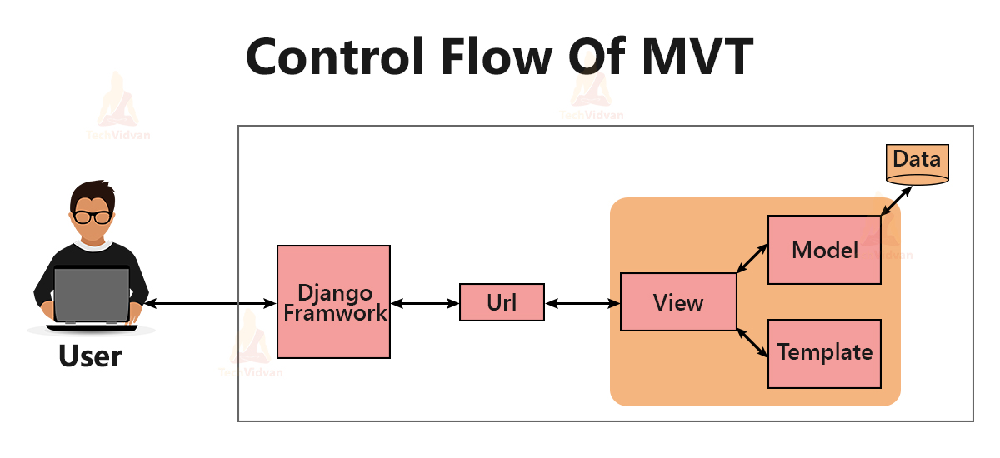

# First Django 
This is my first Django web project.

## Step 1 - Installation

- Create new GitHub repo "first_django"
  - check either public or private
  - check to add the .gitignore file with python template
  - check to add the README.md file 
- Create the requirements.txt file
  - add one line: django
- Use GitHub CodeSpace or clone the project to the local or host environment
  - `$ git clone <github_repo_url>`
  - `$ cd first_django'
- Verify your Python version
  - `$ python --version`
  - Make sure it is 3.8 or above
- Optionally for isolation, create a Python virtual environment
  - `"$ cd ../"` (go outside of your project folder)
  - `$ python -m venv first_django_venv`
  - `$ source first_django_venv/bin/activate` 
- Install Django
  - `$ cd first_django`
  - `$ pip install -r requirements.txt`
- Verify Django installation
  - `$ python -m django --version

## Step 2 - Create the Django web project

- `$django-admin startproject first_website`
- `$ cd first_website`
- `$ python manage.py runserver`
- Don't worry about the red warning messages for now
- Verify the server is up: http://127.0.0.1:8000/ 
  
## Step 3 - Create a Django web application 

> **Projects vs. apps**
>
> What’s the difference between a project and an app? An app is a web application 
> that does something – e.g., a blog system, a database of public records or a small 
> poll app. project is a collection of configuration and apps for a particular website.
> A project can contain multiple apps. An app can be in multiple projects.

- `$ python manage.py startapp pools`
## Step 4 - Follow the Django tutorial

- https://docs.djangoproject.com/en/4.0/intro/tutorial01/

## Django's Model-View-Template (MVT) Architecture

Source: https://techvidvan.com/tutorials/djangos-mvt-architecture/

## Django Project Structure

**first_django/** (GitHub Repo Name)
- .gitignore
- README.md
- requirements.txt
- **first_website/** (`$ django-admin startproject first_website`)
  - db.sqlite3
  - manage.py
  - **first_website/**
    - \_init\_.py
    - asgi.py
    - wsgi.py
    - urls.py
    - settings.py
  - **first_webapp/** (`$ python manage.py startapp first_webapp`)
    - \_init\_.py
    - admin.py
    - apps.py
    - models.py
    - tests.py
    - urls.py
    - views.py
  - **second_webapp/**
  - **third_webapp/**     